# 一、代码自动生成

## 1、环境准备

虚拟机部署若依平台，且服务运行正常，没有问题。MySQL数据库运行正常，电脑上安装有Navicat for MySQL，用于链接虚拟机数据库，方便操作。

### 1）关闭防火墙和SElinux

```
systmectl stop firewalld  #关闭防火墙
systemctl disable firewalld  #永久关闭防火墙
setenforce 0  #临时关闭SElinux（重启后失效）
```

### 2）链接数据库

打开Navicat for MySQL软件，选择链接MySQL

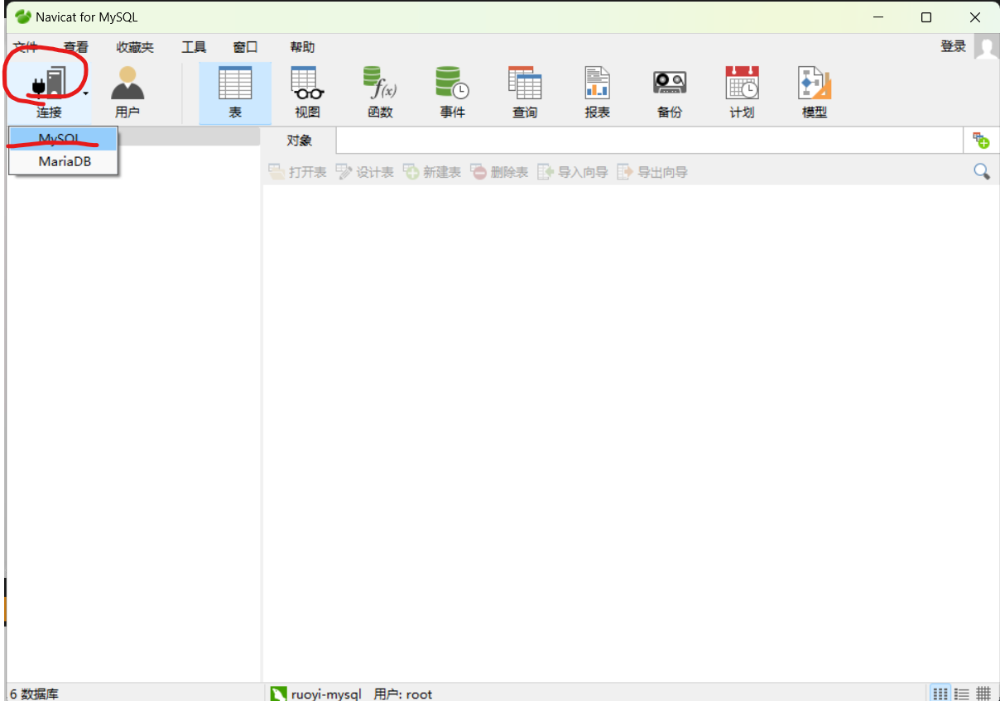

连接名自定义，ip写MySQL数据库所在主机的ip，端口（根据实际情况写，图片上默认是3306），**用户名密码是登录数据库的**。

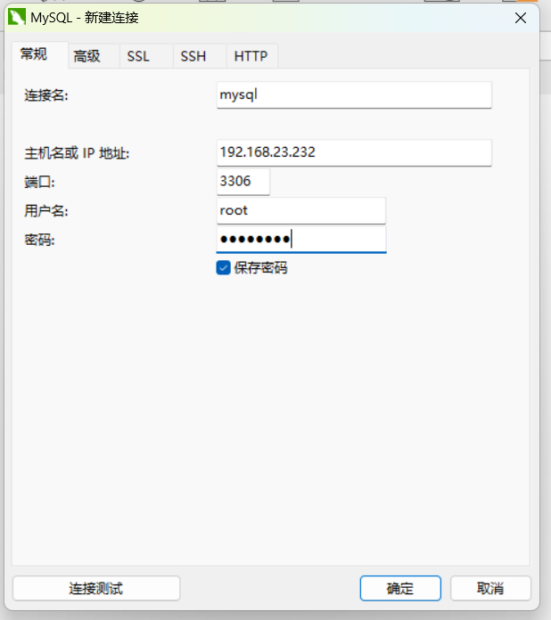

填写完成后，点击连接测试，等待连接成功后，再点击确定

## 2、自动生成代码

```
CREATE TABLE student_base_info (
    id BIGINT PRIMARY KEY AUTO_INCREMENT COMMENT '主键ID',
 
    student_no VARCHAR(32) COMMENT '学生编号',
    class_name VARCHAR(50) COMMENT '班级',
    graduate_date DATE COMMENT '毕业日期',
    student_name VARCHAR(50) NOT NULL COMMENT '学生姓名',
    id_card VARCHAR(18) NOT NULL COMMENT '身份证号（真实）',
 
    project_manager VARCHAR(50) COMMENT '项目经理',
    career_advisor VARCHAR(50) COMMENT '就业指导',
 
    home_address VARCHAR(255) COMMENT '家庭住址（按身份证）',
 
    student_phone VARCHAR(20) COMMENT '学生电话',
    father_phone VARCHAR(20) COMMENT '父亲电话',
    mother_phone VARCHAR(20) COMMENT '母亲电话',
 
    market_dept VARCHAR(50) COMMENT '所属市场部',
 
    current_edu_level VARCHAR(20) COMMENT '当前学历',
    current_graduate_time DATE COMMENT '当前学历毕业时间',
    current_school VARCHAR(100) COMMENT '当前毕业院校',
    current_major VARCHAR(100) COMMENT '当前专业',
 
    studying_edu_level VARCHAR(20) COMMENT '在读学历',
    studying_graduate_time DATE COMMENT '在读毕业时间',
    studying_school VARCHAR(100) COMMENT '在读院校',
 
    certificates VARCHAR(255) COMMENT '所持证书',
 
    create_by VARCHAR(64) COMMENT '创建人',
    create_time DATETIME COMMENT '创建时间',
    update_by VARCHAR(64) COMMENT '更新人',
    update_time DATETIME COMMENT '更新时间',
    remark VARCHAR(500) COMMENT '备注'
) COMMENT='学生基础信息表';
```

### 1）创建完整表sql

打开Navicat for MySQL，找到刚刚加入的数据库，打开ry-cloud库

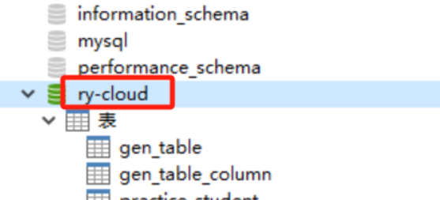

点击查询，再点击新建查询，将上面那一段代码复制到这里，最后点击运行,会生成一个名为student_base_info的一个表

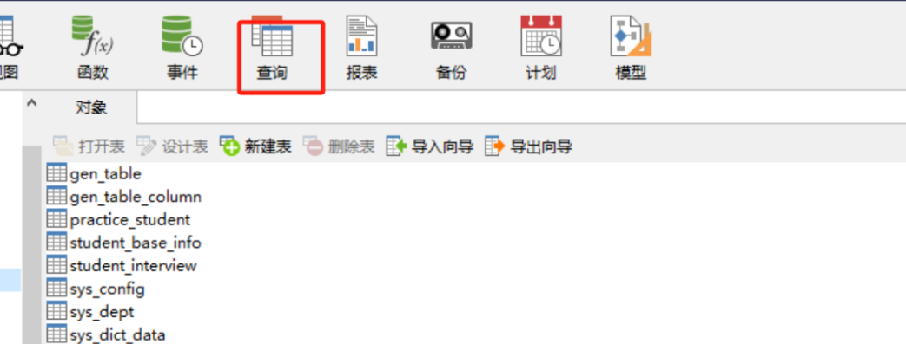

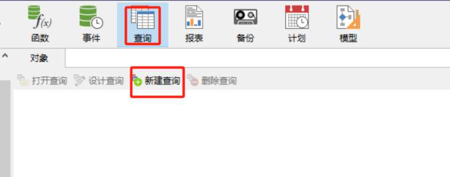

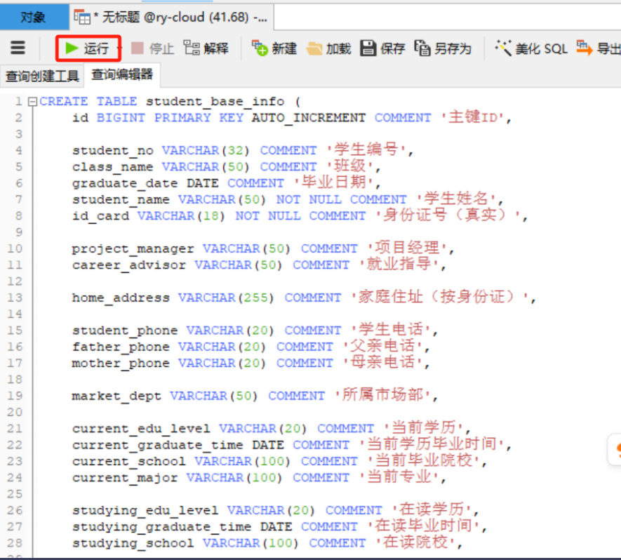

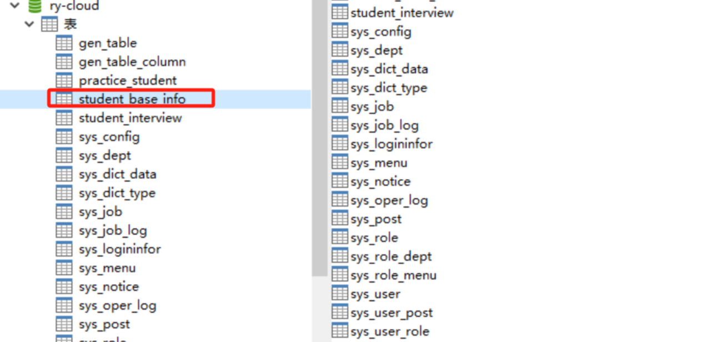

右击studen_base_info,点击设计表，可以查看该表的所有字段

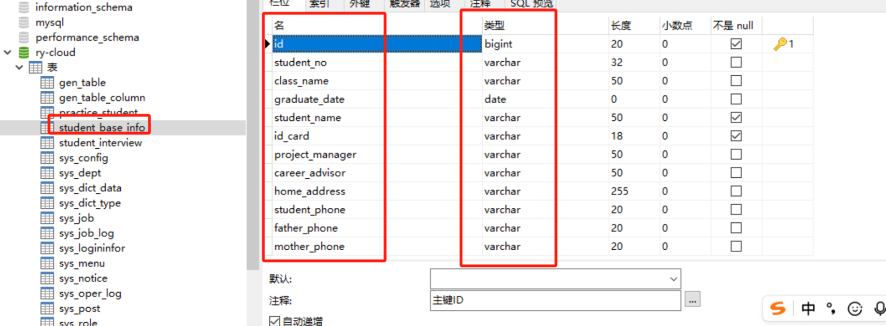

### 2）生成代码

访问若依平台，打开右侧的系统工具，点击代码生成

192.168.23.232访问若依，打开系统工具，找到代码生成

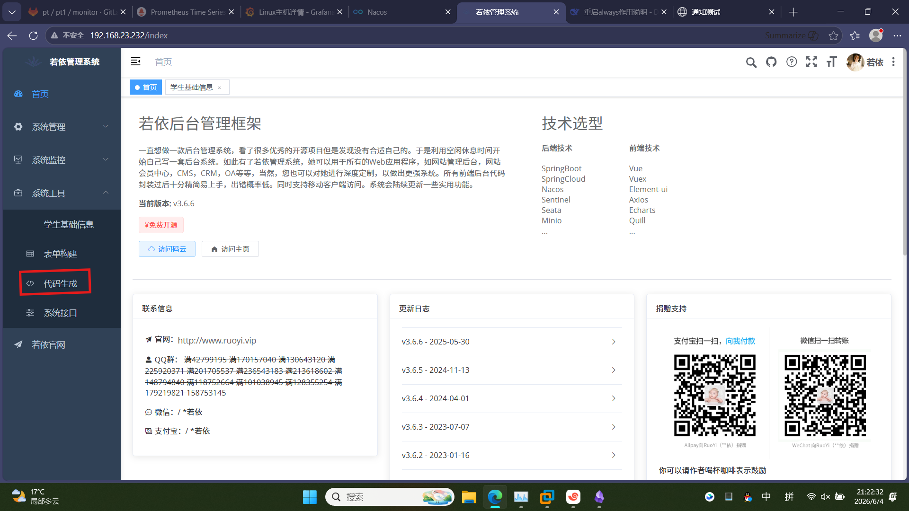

点击导入，选中刚刚创建的studen_base_info表，然后生成代码

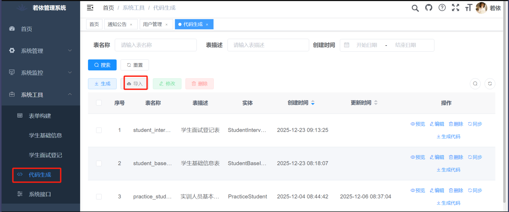

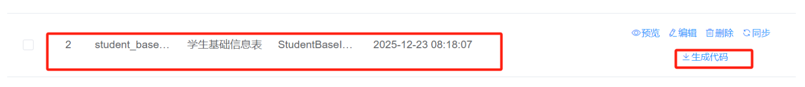

生成后会下载一个ruoyi.zip的压缩包，这是生成的代码，里面包含3个文件

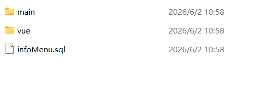
这个包里面，前端目录是vue，后端目录是main，而infoMenu.sql是数据库文件

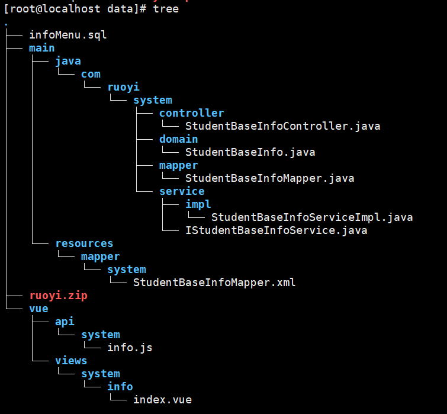

# 二、创建面试平台

## 1、备份前后端文件

1）创建备份文件夹

```
mkdir -p /srv/backup/20260605/ruoyi-ui

mkdir -p /srv/backup/20260605/ruoyi-system
```

2）备份文件

```
cp -r /srv/app/tools/RuoYi-Cloud-v3.6.6/ruoyi-ui/src /srv/backup/20260605/ruoyi-ui

rm -rf /srv/app/tools/RuoYi-Cloud-v3.6.6/ruoyi-modules/ruoyi-system/target
cp -r /srv/app/tools/RuoYi-Cloud-v3.6.6/ruoyi-modules/ruoyi-system/* /srv/backup/20260605/ruoyi-system
```

## 2、部署打包

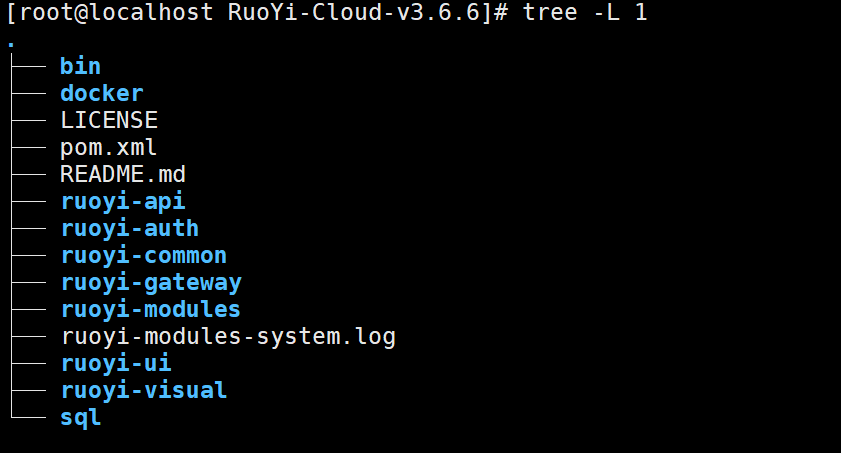

进入前端目录：ruoyi-ui

```
cd /srv/app/tools/RuoYi-Cloud-v3.6.6/ruoyi-ui/

rm -rf dist  #删除旧的打包文件

cd src

cp -r /srv/data/vue/api ./  #将生成的代码包里的前端文件api复制到当前前端的相同目录下

ls api/system/  #验证一下是否复制成功

cp -r /srv/data/vue/views ./  #将生成的代码包里的前端文件views复制到当前前端的相同目录下

ls views/system/info/  #验证一下是否复制成功

cd /srv/app/tools/RuoYi-Cloud-v3.6.6/ruoyi-ui/  #切换到ruoyi-ui目录

npm run build:prod  #重新打包

ls   #查看当前目录下是否生成dist打包文件
```

## 3、后端打包

进入后端目录：ruoyi-modules/ruoyi-system

```
#进入后端目录
cd /srv/app/tools/RuoYi-Cloud-v3.6.6/ruoyi-modules/ruoyi-system

cd src/main/java/com/ruoyi/system

#复制后端文件到后端目录
cp /srv/data/main/java/com/ruoyi/system/controller/ ./
cp /srv/data/main/java/com/ruoyi/system/domain/ ./
cp /srv/data/main/java/com/ruoyi/system/mapper/ ./
cp /srv/data/main/java/com/ruoyi/system/service/ ./

#验证查看是否复制成功
ls controller/
ls domain/
ls mapper/
ls service/
ls service/impl
```

```
#进入目录
cd /srv/app/tools/RuoYi-Cloud-v3.6.6/ruoyi-modules/ruoyi-system

cd src/main/resources/mapper

#复制后端文件到后端目录
cp /srv/data/main/resources/mapper/system ./

#验证查看
ls system/

#Maven打包
cd /srv/app/tools/RuoYi-Cloud-v3.6.6/ruoyi-modules/ruoyi-system
mvn clean install 

#验证是否打包成功
ll target/ruoyi-modules-system.jar

#生成MD5用于验证jar包
md5sum target/ruoyi-modules-system.jar
```

## 4、前后端部署

```
cd /srv/app/tools/RuoYi-Cloud-v3.6.6/docker

sh copy.sh   #将重新打包的前后端文件和jar包

md5sum ruoyi/modules/system/jar/ruoyi-modules-system.jar  #与前面生成的md5验证，是否是同一个

#杀掉ruoyi-modules-system
ps -ef | grep ruoyi-module-system | grep -v grep | awk '{print $2}' | xargs kill -9

#启动
nohup java -jar ./ruoyi/modules/system/jar/ruoyi-modules-system.jar > ruoyi-modules-system.log &

#查看进程是否启动
ps -ef | grep -i ruoyi- | grep -v grep
```

## 5、写入sql数据

打开navicat，选择ry-cloud库，点击查询，再点击新建查询

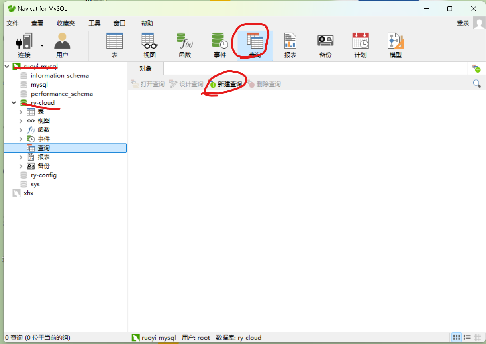

```
-- 菜单 SQL
insert into sys_menu (menu_name, parent_id, order_num, path, component, is_frame, is_cache, menu_type, visible, status, perms, icon, create_by, create_time, update_by, update_time, remark)
values('学生基础信息', '3', '1', 'info', 'system/info/index', 1, 0, 'C', '0', '0', 'system:info:list', '#', 'admin', sysdate(), '', null, '学生基础信息菜单');

-- 按钮父菜单ID
SELECT @parentId := LAST_INSERT_ID();

-- 按钮 SQL
insert into sys_menu (menu_name, parent_id, order_num, path, component, is_frame, is_cache, menu_type, visible, status, perms, icon, create_by, create_time, update_by, update_time, remark)
values('学生基础信息查询', @parentId, '1',  '#', '', 1, 0, 'F', '0', '0', 'system:info:query',        '#', 'admin', sysdate(), '', null, '');

insert into sys_menu (menu_name, parent_id, order_num, path, component, is_frame, is_cache, menu_type, visible, status, perms, icon, create_by, create_time, update_by, update_time, remark)
values('学生基础信息新增', @parentId, '2',  '#', '', 1, 0, 'F', '0', '0', 'system:info:add',          '#', 'admin', sysdate(), '', null, '');

insert into sys_menu (menu_name, parent_id, order_num, path, component, is_frame, is_cache, menu_type, visible, status, perms, icon, create_by, create_time, update_by, update_time, remark)
values('学生基础信息修改', @parentId, '3',  '#', '', 1, 0, 'F', '0', '0', 'system:info:edit',         '#', 'admin', sysdate(), '', null, '');

insert into sys_menu (menu_name, parent_id, order_num, path, component, is_frame, is_cache, menu_type, visible, status, perms, icon, create_by, create_time, update_by, update_time, remark)
values('学生基础信息删除', @parentId, '4',  '#', '', 1, 0, 'F', '0', '0', 'system:info:remove',       '#', 'admin', sysdate(), '', null, '');

insert into sys_menu (menu_name, parent_id, order_num, path, component, is_frame, is_cache, menu_type, visible, status, perms, icon, create_by, create_time, update_by, update_time, remark)
values('学生基础信息导出', @parentId, '5',  '#', '', 1, 0, 'F', '0', '0', 'system:info:export',       '#', 'admin', sysdate(), '', null, '');
```

将sql文件复制，写入新建查询（可以再点击美化），点击运行

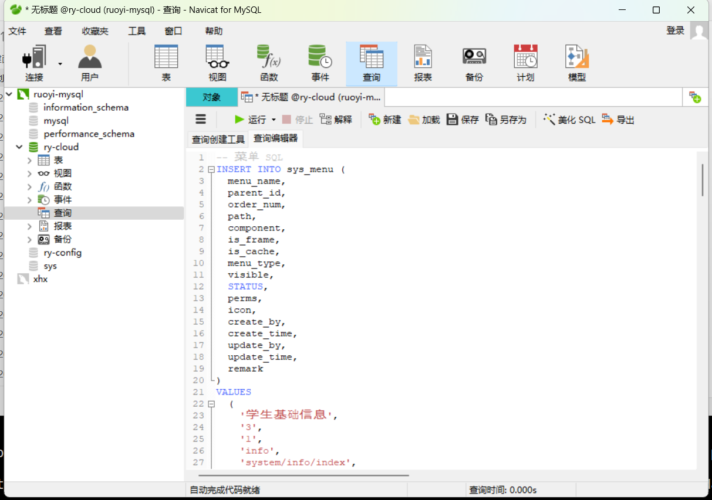

6、访问测试

浏览器：192.168.23.232

刷新页面，点击系统工具


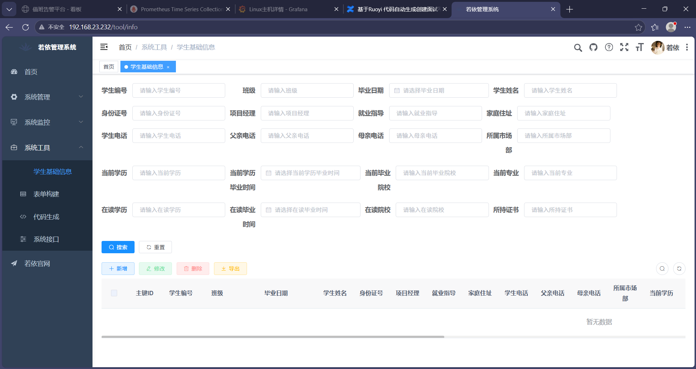